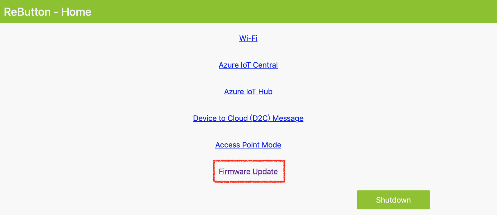
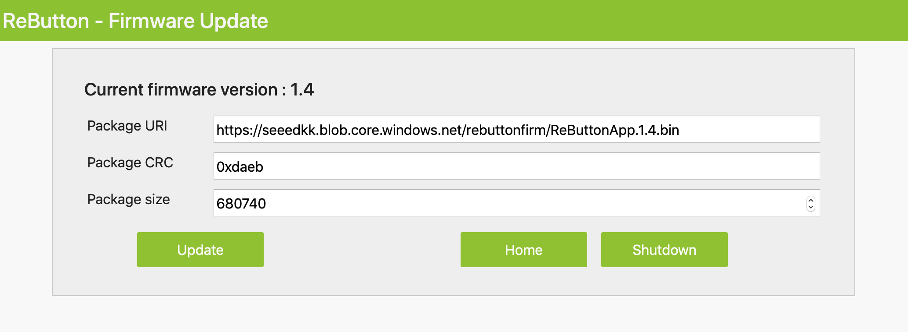
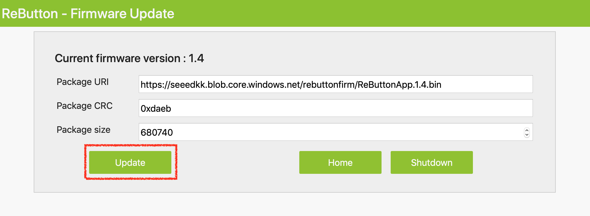

# Update firmware of ReButton
### IMPORTANT - Please make sure your ReButton has enough battery before start updating the firmware.

1. Connect your ReButton(AZB-XXXXXXXX) and open **192.168.0.1** in browser.

2. Goto ReButton - `Firmware Update` page.



3. Fill in:
```
Package URI:	https://seeedkk.blob.core.windows.net/rebuttonfirm/ReButtonApp.1.4.bin
Package CRC:	0xdaeb
Package size:	680740
```

> You may find the information in [firmware](https://github.com/SeeedJP/ReButton/tree/master/firmware) website.

4. Keeping pressing the ReButton, and click `Update`.



5. Hold button until RGB LED starts blinking. ReButton is downloading the firmware image, checking CRC, and flashing new image. This will take about 30 seconds.

6. Release button when RGB LED turns into White. So that you are entering AP mode with new firmware.

7. The browser should redirect to the home page of ReButton(192.168.0.1).

> You may need to setup the Wi-Fi connection and Azure IoT Central again.

## Done!
<br><br>

#### Reference:
- https://seeedjp.github.io/ReButton
- https://github.com/SeeedJP/ReButton/blob/master/OTA.md#step-3-ota-process
- https://github.com/SeeedJP/ReButton/tree/master/firmware