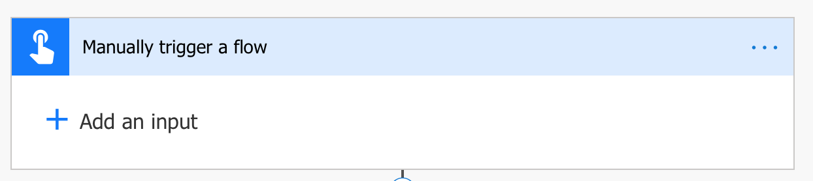

# Using Microsoft Flow to show the weather forecast with YeeLight

This tutorial will tell you how to change the YeeLight color due to the temperature forecast by using the Microsoft Flow.

### Create a new flow
1. [Microsoft Flow](https://flow.microsoft.com)

### Start flowing
1. Manually trigger a flow

2. Get forecast for today

3. Send me a mobile notification (Optional)

4. Discover (Preview)

5. Condition
 5.1 If Yes
 5.2 If No